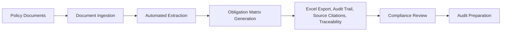

# Business Requirements Document (BRD)
## Compliance Assistant for Banking & Financial Services

**Document Version:** 1.0  
**Date:** August 2025  
**Prepared for:** Chief Operating Officer   

## Purpose of this document

This document is for human consumption. It outlines the business requirements for the Compliance Assistant project. This document serves as the foundation for technical documents that will be used for agent consumption.

## 1. Executive Summary
### Business Problem
Our banking and financial services organization faces significant operational challenges in managing IT security and data privacy compliance obligations. Currently, business analysts spend excessive manual effort creating and maintaining obligation matrices, creating operational inefficiencies and audit risks. With an upcoming audit in 6-12 months, we need an automated solution to ensure 100% coverage of compliance obligations and reduce the risk of compliance and audit failures.

### Proposed Solution
The Compliance Assistant is an intelligent document analysis system that automatically extracts, analyzes, and tracks compliance obligations from our policy documents. This solution will transform our manual compliance process into an automated, proactive system that ensures comprehensive obligation coverage.

## 3. Business Objectives and Success Metrics
### Primary Objectives
- Automate Obligation Matrix Creation: Replace manual analyst work with intelligent document processing
- Ensure Audit Compliance: Achieve 100% coverage of compliance obligations with high degree of accuracy
- Reduce Operational Risk: Minimize human error in compliance tracking
- Optimize Resource Allocation: Redirect analyst time to higher-value activities

### 3.1 Functional Requirements
#### Core Capabilities
Phase 1:
- Automated extraction of compliance obligations from compliance policy documents according to a defined template.
- Automated generation of comprehensive obligation matrices from policy documents according to a defined template.
- Export to Excel/spreadsheet formats
- Maintain audit trails for all obligations identified within matrices
- Provide source citations within matrices

Future state:
- Proactive Compliance Monitoring
- Alert users to new or updated obligations
- Identify potential compliance gaps
- Provide recommendations for policy updates

### 3.2 Non-Functional Requirements
- Performance Requirements
User-triggered system (not real-time).
The system should be able to handle up to 100 documents at a time.  
- Security Requirements
Any LLM models used in the solution must meet the companies's own security standards and policies.
- Cost Requirements
The system should be cost-effective from token usage perspective.

## 4. Implementation Timeline 

### Success Metrics (Phase 1)
| Metric | Current State | Target State | Timeline |
|--------|--------------|--------------|----------|
| Obligation Matrix Coverage | Manual, incomplete | 100% automated coverage | 6 months |
| Analyst Time on Compliance | 10+ hours/week | <2 hours/week | 4 months |
| Audit Preparation Time | ? hours | ? hours | 8 months |
| Audit Pass Rate | n/a | 100% | 12 months |

### Process Flow Diagram

